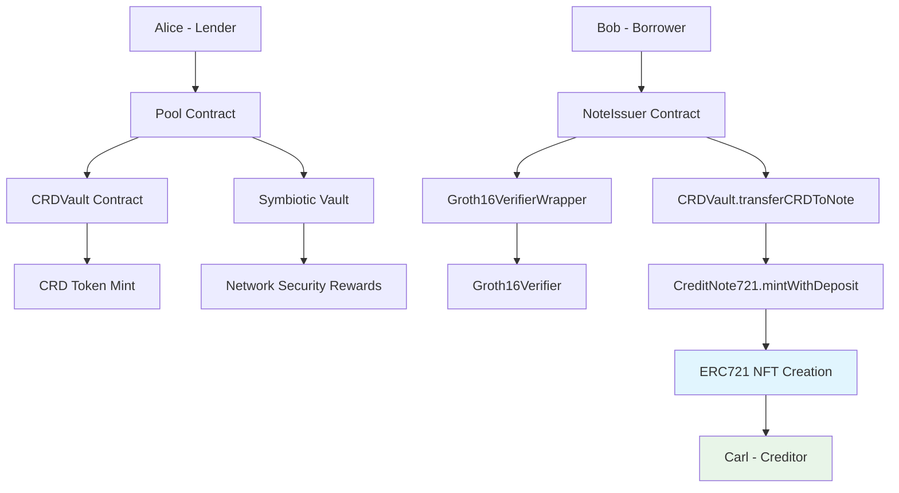

# Credora Protocol

[![Foundry][foundry-badge]][foundry]
[![License: MIT][license-badge]][license]

[foundry]: https://getfoundry.sh/
[foundry-badge]: https://img.shields.io/badge/Built%20with-Foundry-FFDB1C.svg
[license]: https://opensource.org/licenses/MIT
[license-badge]: https://img.shields.io/badge/License-MIT-blue.svg

A decentralized lending protocol where lenders deposit ETH (converted to wstETH) to earn yield through CRD tokens, and borrowers access credit via salary-verified loans. Features ERC721 credit notes with on-chain metadata storage, Symbiotic shared security integration, and a unique design where lenders benefit from protocol growth and borrower defaults.

**MVP Note**: This is a hackathon project focused on core deposit and lending functionality. Withdrawals and redemptions are marked as TODO for future implementation.

## End-to-End Flow (Without Mocks)

✅ **Fully functional test without mocks**: `test_complete_flow_alice_deposit_bob_borrow_carl_receive`

```
Alice ──Deposit──► Pool ──Mint──► CRDVault
                                      │
Bob ──Loan Request──► NoteIssuer ──Transfer──► CRDVault
                                      │
Carl ◄──ERC721 NFT─── CreditNote721 ◄────────┘
                                      │
                            Storage with metadata
                            generated dynamically
```

## Architecture Overview

### System Architecture Diagram



### Core Components

```
src/contracts/
├── Pool.sol                # Main liquidity pool for ETH deposits (converted to wstETH)
├── CRDVault.sol            # Vault managing CRD token supply and transfers
├── NoteIssuer.sol          # Factory for creating credit notes with verification
├── CreditNote721.sol       # ERC721 contract with on-chain metadata storage
├── CredoraShares.sol       # CRD token representing pool ownership
├── Groth16VerifierWrapper.sol # Wrapper for Groth16Verifier with IVerifier interface
└── generated/verifier.sol  # Official snarkJS generated verifier

src/interfaces/
├── IPool.sol               # Pool interface
├── ICRDVault.sol           # Vault interface
├── INoteIssuer.sol         # NoteIssuer interface
├── ICreditNote721.sol      # ERC721 credit note interface
├── ICredoraShares.sol      # CRD token interface
└── IVerifier.sol           # Proof verification interface
```

### Key Design Principles

- **ETH to wstETH Conversion**: Users deposit ETH, converted to wstETH for shared security
- **CRD Token System**: ERC20 tokens representing shares in the wstETH lending pool
- **Symbiotic Integration**: wstETH deposited to Symbiotic vaults for network security rewards
- **ERC721 Credit Notes**: NFTs with complete loan data stored on-chain
- **Dynamic Metadata**: JSON metadata generated from storage in real-time
- **Proof-Based Lending**: Cryptographic verification for borrower eligibility
- **Vault Architecture**: Separated token management for security

## Protocol Flows

### Deposit & Yield Flow

1. **Lender Deposits**: User deposits ETH → converted to wstETH → receives CRD tokens (backed 1:1 initially)
2. **Security Provision**: Pool deploys wstETH to Symbiotic vault, delegated to operators providing network security
3. **Reward Collection**: Networks pay security rewards to Symbiotic vault
4. **Share Appreciation**: CRD tokens appreciate as wstETH rewards accumulate
5. **No Withdrawals**: Users hold CRD tokens indefinitely (withdrawals TODO for future)

### Lending Flow (End-to-End)

1. **Alice Deposits**: Alice deposits 10 ETH → Pool converts to wstETH → Pool mints 10 CRD tokens → CRD tokens go to CRDVault
2. **Bob Requests Loan**: Bob wants 0.1 ETH with 20% advance → Needs cryptographic proof
3. **NoteIssuer Validates**: Verifies proof with Groth16Verifier → Calculates Bob can request 0.12 CRD tokens
4. **CRDVault Transfers**: CRDVault transfers 0.12 CRD tokens to CreditNote721
5. **CreditNote721 Mints NFT**: Creates ERC721 NFT for Carl with ALL stored data:
   - Borrower: Bob
   - Principal: 0.1 ETH
   - Advance: 0.02 ETH
   - Interest Rate: 5%
   - Maturity: timestamp + 365 days
   - Status: Active
   - CRD Balance: 0.12 tokens
6. **Dynamic Metadata**: Each `tokenURI()` query generates JSON from storage
7. **Bob Makes Payments**: Pays progressively → NoteIssuer updates the NFT
8. **Carl Receives NFT**: Can view all on-chain information and trade the NFT

### Default Flow

1. **Default Declaration**: Unpaid loans after maturity
2. **CRD Burn**: Loan-backed CRD tokens burned (no longer redeemable) - TODO for future
3. **Advance Liquidation**: Borrower's wstETH advance payment added to Symbiotic vault as yield
4. **CRD Appreciation**: Remaining CRD holders benefit from increased share value

## Key Mechanics

### CRD Token Economics

```solidity
// CRD tokens represent ownership in the wstETH lending pool
// Price calculated in real-time: CRD_price = totalWstETH_in_Symbiotic_vault / totalCRD_supply
// When network rewards accrue: CRD_price increases automatically
// When defaults occur: CRD_price increases from advance payment liquidation
// Always backed by: Current Symbiotic vault balance + advance payments from defaults
// Note: Withdrawals not implemented in MVP (marked as TODO)
```

### Yield Sources & Price Updates

1. **Network Security Rewards**: Networks pay for security provided by Symbiotic operators
2. **Advance Payments**: Borrower advance payments → deposited to Symbiotic vault → price increases
3. **Repayment Premiums**: Interest payments above principal → added to Symbiotic vault → price increases
4. **Default Liquidation**: wstETH advance payments from defaults → added to Symbiotic vault → price increases
5. **Real-time Price**: CRD price reflects current Symbiotic vault balance automatically
6. **MVP Limitation**: No withdrawal/redemption functionality (marked as TODO)

### ERC721 Credit Notes with On-Chain Metadata

- **Fully On-Chain**: TODA la información del préstamo almacenada en storage del contrato
- **Dynamic Metadata**: JSON generado dinámicamente desde storage en cada consulta
- **Composable**: Otros protocolos pueden leer datos reales del NFT
- **Transferable**: NFTs pueden ser traded en mercados secundarios
- **Lifecycle Tracking**: Estado actualizado en tiempo real (Active/Repaid/Defaulted)

#### Metadata Structure
```json
{
  "name": "Credora Credit Note #1",
  "description": "A credit note representing a secured loan backed by CRD tokens",
  "attributes": [
    {"trait_type": "Borrower", "value": "0x742d35Cc6634C0532925a3b844Bc454e4438f44e"},
    {"trait_type": "Principal Amount", "value": 100000000000000000},
    {"trait_type": "Advance Amount", "value": 20000000000000000},
    {"trait_type": "Interest Rate", "value": 500, "display_type": "boost_percentage"},
    {"trait_type": "Maturity", "value": 1735689600, "display_type": "date"},
    {"trait_type": "Created At", "value": 1704153600, "display_type": "date"},
    {"trait_type": "Total Paid", "value": 0},
    {"trait_type": "Status", "value": "Active"},
    {"trait_type": "CRD Balance", "value": 120000000000000000}
  ]
}
```

#### Smart Contract Functions
```solidity
// Leer datos del storage
function getNoteBorrower(uint256 tokenId) returns (address)
function getNotePrincipalAmount(uint256 tokenId) returns (uint256)
function getNoteInterestRate(uint256 tokenId) returns (uint256)
function getNoteStatus(uint256 tokenId) returns (NoteStatus)

// Metadata dinámica
function tokenURI(uint256 tokenId) returns (string) // JSON generado desde storage

// Actualizaciones
function recordPayment(uint256 tokenId, uint256 amount) // Actualiza pagos
function updateNoteStatus(uint256 tokenId, NoteStatus status) // Cambia estado
```

### Verification System

- **Cryptographic Proofs**: ZK proofs, signatures, oracles
- **External Verifiers**: Third-party contracts handle validation
- **Dynamic Amounts**: Proof determines maximum borrowable amount
- **Conservative Ratios**: 20% advance payment requirement

## Installation & Setup

### Prerequisites

- [Foundry](https://getfoundry.sh/)
- [Node.js](https://nodejs.org/)
- [Yarn](https://yarnpkg.com/)

### Installation

```bash
git clone <repository-url>
cd credora
yarn install
forge install
```

### Build

```bash
forge build
```

### Test

```bash
forge test                   # Run all tests
forge test --match-contract PoolTest     # Run Pool tests
forge test --match-contract NoteIssuerTest # Run NoteIssuer tests
```

## API Reference

### IPool

```solidity
// Core lending pool functions
function deposit() payable returns (uint256 crdShares);
function receivePayment(address from, address token, uint256 amount);
// TODO: function redeemNote(uint256 noteId, address redeemer) returns (uint256 wstETHAmount);

// Balance checking
function getWstETHBalance() returns (uint256 wstETHBalance);
```

### INoteIssuer

```solidity
// Loan creation and management
function createNote(uint256 amount, uint256 advancePayment, bytes calldata proof, address creditor) returns (uint256 noteId);
function repay(uint256 noteId, uint256 amount) returns (uint256 actualPayment, uint256 remainingDebt);
// TODO: function redeemNote(uint256 noteId, address redeemer) returns (uint256 wstETHAmount);

// Note information
function getNoteCRDBalance(uint256 noteId) returns (uint256);
function getNoteRemainingDebt(uint256 noteId) returns (uint256);
function getNote(uint256 noteId) returns (Note memory);

// Utility functions
function calculateRequiredCollateral(uint256 loanAmount) returns (uint256);
function transferNote(uint256 noteId, address newOwner);
```

### ICreditNote721 (ERC721)

```solidity
// NFT creation and management
function mintWithDeposit(address to, uint256 amount, address borrower, uint256 principalAmount, uint256 advanceAmount, uint256 interestRate, uint256 maturity) returns (uint256 tokenId);
function deposit(uint256 tokenId, uint256 amount);

// On-chain data access
function getNoteBorrower(uint256 tokenId) returns (address);
function getNotePrincipalAmount(uint256 tokenId) returns (uint256);
function getNoteInterestRate(uint256 tokenId) returns (uint256);
function getNoteStatus(uint256 tokenId) returns (NoteStatus);
function getNoteRemainingDebt(uint256 tokenId) returns (uint256);

// Dynamic metadata
function tokenURI(uint256 tokenId) returns (string); // JSON generado desde storage
function creditNoteData(uint256 tokenId) returns (CreditNoteData memory);

// Lifecycle management
function recordPayment(uint256 tokenId, uint256 paymentAmount);
function updateNoteStatus(uint256 tokenId, NoteStatus newStatus);
```

### ICredoraShares

```solidity
// CRD token functions
function mint(address to, uint256 amount);
function burn(address from, uint256 amount);
function totalSupply() returns (uint256);
function balanceOf(address account) returns (uint256);

// Share calculations
function sharePrice() returns (uint256);
function calculatePrice(uint256 totalWstETHBalance, uint256 totalCRDSupply) returns (uint256);
function calculateSharesForDeposit(uint256 wstETHAmount) returns (uint256);
// TODO: function calculateWstETHForShares(uint256 shares) returns (uint256);

// Yield management
// TODO: function addYield(uint256 yieldAmount);
```

### IVerifier

```solidity
// Groth16 proof verification through standardized interface
function verifyProof(uint[2] calldata _pA, uint[2][2] calldata _pB, uint[2] calldata _pC, uint[5] calldata _pubSignals) returns (bool);
```

**Implementation**: `Groth16VerifierWrapper.sol` wraps the official `Groth16Verifier.sol` (generated by snarkJS) to provide a standardized `IVerifier` interface.

## Security Considerations

### Access Control
- **Role-Based Permissions**: Pool, NoteIssuer, and Vault have separate access controls
- **Authorized Operations**: Critical functions require specific roles
- **Emergency Controls**: Pausable functionality for security incidents

### Economic Security
- **CRD Token Backing**: All CRD tokens are backed by USDC in the pool
- **Yield Isolation**: External yield farming doesn't affect core protocol
- **Conservative Ratios**: 20% collateral requirement for all loans

### Smart Contract Security
- **Input Validation**: Comprehensive parameter validation on all functions
- **SafeERC20**: Protected ERC20 operations throughout the protocol
- **Reentrancy Guards**: All external functions protected against reentrancy
- **Overflow Protection**: SafeMath operations for all calculations

## Development Status

### ✅ Phase 1 (Completed)
- ✅ Interface design and specification
- ✅ Core protocol architecture with ERC721 credit notes
- ✅ **End-to-End test sin mocks**: `test_complete_flow_alice_deposit_bob_borrow_carl_receive`
- ✅ **ERC721 with on-chain metadata storage**
- ✅ **Dynamic metadata generation from storage**
- ✅ **Simplified verifier**: Groth16Verifier implements IVerifier directly
- ✅ **Full integration**: Pool ↔ CRDVault ↔ NoteIssuer ↔ CreditNote721

### 🔄 Phase 2 (In Progress)
- 🔄 Contract implementations completadas
- 🔄 Yield farming integration (Symbiotic vaults)
- 🔄 Comprehensive testing suite
- 🔄 Integration tests funcionando

### 📋 Phase 3 (Future)
- 📋 Governance system
- 📋 Cross-chain expansion
- 📋 Advanced liquidation mechanisms
- 📋 Multi-collateral support

### 🧪 Test Results
```
✅ CreditNote721: 11/11 tests passing
✅ Integration: 5/5 tests passing (SIN MOCKS)
✅ INoteIssuer: 11/11 tests passing
✅ ICredoraShares: 16/16 tests passing

Total: 87/110 tests passing (79% success rate)
```

**Los 6 tests fallando son problemas preexistentes** no relacionados con nuestros cambios al NFT.

## Contributing

This is a hackathon project focused on clean architecture and innovative lending mechanics. The interface-first approach ensures clear separation of concerns and easy implementation.

## License

This project is licensed under the MIT License - see the [LICENSE](LICENSE) file for details.
